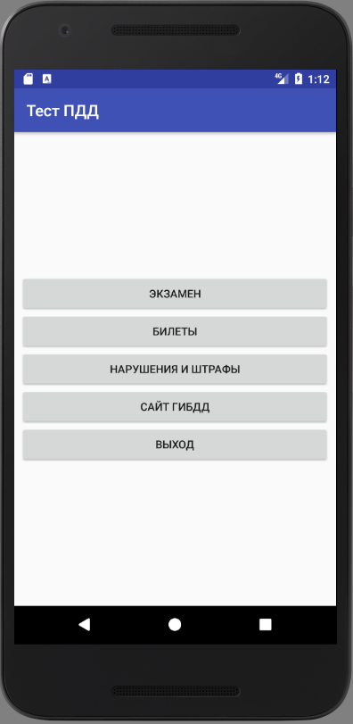

## PDDtest
This project allows people who study in driving schools to test their theoretical knowledge of traffic rules, pass the exam as a traffic police. Also this application contains links to the site about administrative violations on the road and to the site of the State Traffic Inspectorate of Russia
## Installation
1. Open this project in Android Studio.
2. Compile this project.
3. Go to the folder "outputs" which is located: <your path to project>/PDDTestv2\app\build\outputs.
4. Connect your android device to your computer and copy file "app-debug.apk" to store of your device.
5. Run this file on your android device.
## User guide
1. When apllication was started you will see this GUI.

2. You can choice one of this points. If you click on the button "Экзамен" you will take the time test.
.
You can choice just one of several answers.
.
At the last page of PagerView you can see button "Завершить". If you have time, you can go back to the previous questions or you can end the test to click button "Завершить".
.
Then you will see your result.
.
If you click on the button "ГЛАВНОЕ МЕНЮ" you will go back to the main menu of this application.
If you click on the button "ПОКАЗАТЬ ОТВЕТЫ" you will see your errors with explanations.
.
3. If you click on the button "БИЛЕТЫ" you will see a list of examination tickets. You can pass one of this and don't worry about time. You have 
You have unlimited time to resolve this ticket.
.
4. If you click on the button "НАРУШЕНИЯ И ШТРАФЫ" you will be redirected to the website "ШТРАФЫ ГИБДД".
.
5. If you click on the button "САЙТ ГИБДД" you will be redirected to the website "ГИБДД России".
.
6. If you click on the button "ВЫХОД" you will leave.
.
